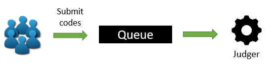
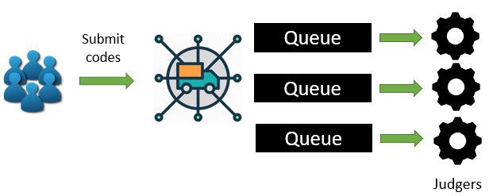

# Software Design & Microservices

We will talk about the whole software design & design process in this section.

There are many design aspects, I recommend you to read in the sequence of the following list:

 1. [DDD](software-design/ddd/)
 2. [Microservices](software-design/microservices/)
 3. [Clean Architecture](software-design/clean-architecture/)
 4. [Database Schema Design](software-design/database-schema/)
 5. [Judger Design](software-design/judger-design/)
 6. [DevOps Design](software-design/devops-design/)
 7. [Deployment Design (Docker / K8S)](software-design/deployment-design/)

##  Design Motivation

### Background
 
Modern Online Judge system queues the codes, compiles and tests them in a FIFO manner.  

The **FIFO judges are not scalable** under massive amount of concurrent submissions.  
To mitigate the problem, some online judges are improved to support multi-node FIFO judges, 
where each node holds a FIFO queue to increase the throughput. 

However, **multi-node FIFO judges is not efficient when resource scheduling or sharing matters**.  
For example, time-intensive judges such as **GPU-related codes**.   
As each requests a couple of GPU devices and executes for a longer time compared to regular codes. 
In such case, we need a middleware that helps schedule the resources and run the judges in a distributed way.

### DDD & Microservice's Methodology Exploration

To be honest, this project has another humble objective: **to see how Domain Driven Design (DDD), 
Clean Architecture (a methodology written in Uncle Bob's book) and Microservices apply in the complex real world demands.**

Thus this project will be an open source and any discussion or contributions are welcome.

## Project Objectives

1. Implement a scalable and maintainable online judge system that judges massive amount of codes in parallel, as to increase throughput.
2. Encapsulate the judges within Docker containers and sandboxes to ensure security.
3. Integrate Kubernetes over multiple nodes to enable resource scheduling (e.g. GPUs, CPUs and Memory) among judges.
4. Use microservices design pattern to enhance maintainability and extensibility.
5. Start an open source project on Github so other developers can contribute to the code-base. (github.com/Judge-Girl)
