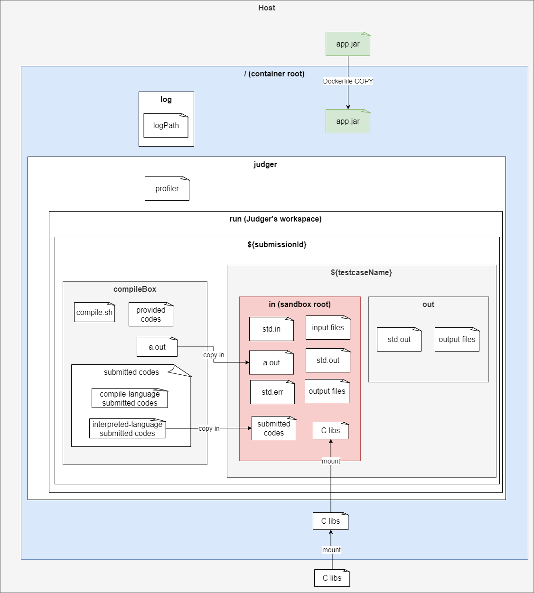
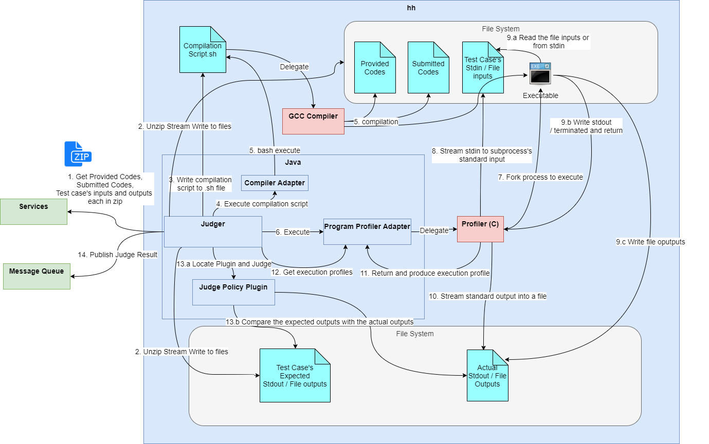

# Judger Design

> Judger, the core component that encapsulates the `Code Submission & Judge Flow`, but it actually complicates more than what ou expect.

## Files Layout

**Judger is run within a docker container**, for certain security issue we design its files layout as the diagram below.

> `app.jar` is the Judger's jar. Kubernetes will execute the jar to start the Judger.

The red package `in` is the sandbox root, that is, 
the `submitted codes` will be run and restricted its access only within this director (via `chroot`).

> Note that the runtime libraries (e.g. C) must be mounted into the container.

## Judger's Flow

The following diagram presents the Judger's flow in details.

> View the clear diagram **[here](https://i.imgur.com/SXtqmmH.png)**

* Basically Judger retrieves Problem and Submission from services and writes testcase's I/O and submitted codes into the files,
invokes compiler to compile the submitted codes with provided codes, runs the codes in a sandbox (written in C),
 streams the standard outputs and errors into files, invokes Judge Policy Plugin to judge based on the policy specified, 
and finally, publishes the verdict result via Message Queue.

> Judger will die after it publishes the verdict result, since it's merely a job on K8S.
