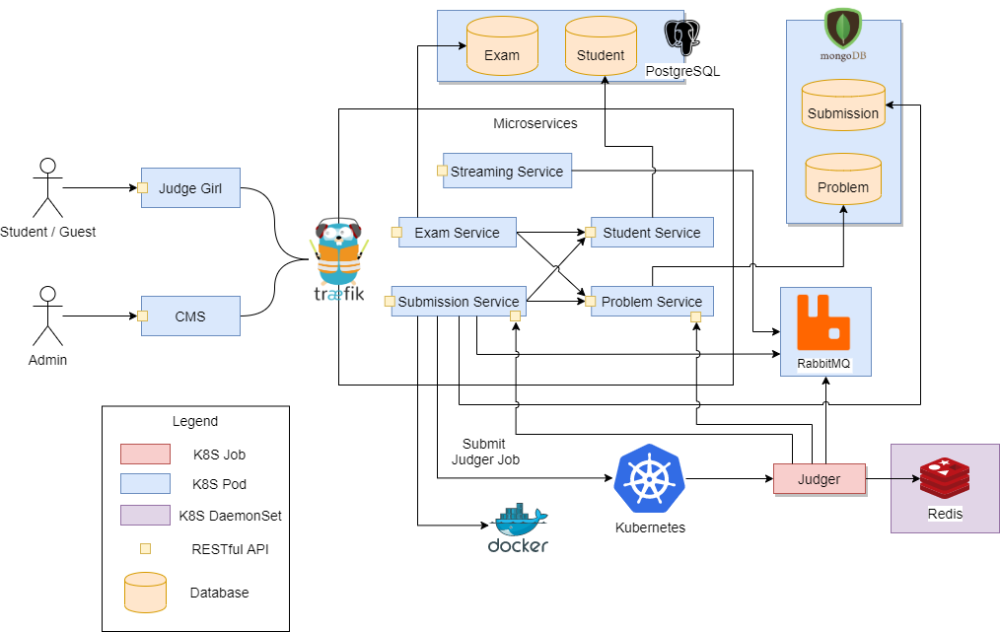

# System Architecture

From DDD, we've had an overview of our domain language and context.

**The next step is to directly design a service for every bounded context.**   

## System Architecture

As a student, I consider not to have too many services, 
so the system won't require too much effort on *[DevOps](https://en.wikipedia.org/wiki/DevOps)*. 
Finally, there are totally 4+1 services:
1. **Student Service**
2. **Problem Service**
3. **Submission Service**
4.**Exam Service**

And one auxiliary service: **Streaming Service**

We concluded the system architecture diagram as below:

## Microservices

`Student Service`, `Problem Service`, `Submission Service` and `Exam Service`
are originated from our domain. Each of them exposes a **[RESTful API](https://en.wikipedia.org/wiki/Representational_state_transfer)**
to others, and all of the microservices are encapsulated and load-balanced behind an **[API gateway](https://microservices.io/patterns/apigateway.html)** 
(in our case, **[Traefik](https://docs.traefik.io/)**).

All the services can be deployed via Kubernetes (or Docker-compose) 
along with those infra components (MySQL, MongoDb, RabbitMQ, ...and so on.). 
See [Deployment Tutorial](deployments/).

## Code Submission & Judge Flow

> This is by far the most important part of understanding how Judge Girl works.

- The Code Submission & Judge Flow is conducted in the following sequence:
1. Student logs in via `Student Service`, and retrieves problems from `Problem Service`
2. Student submits his source codes to solve a problem via `Submission Service`:
3. `Submission Service` then invokes `Kubernetes` to deploy a `Judger`
 job with resource constraints specified by the Problem instance's [Env Spec](domain/problem/env-spec/). 
 A [CE](domain/submission/judge/) [verdict](domain/submission/verdict/) immediately responds when `Submission Service` notices that the codes cannot compile.
4. `Kubernetes` (also support Docker-compose, if you don't own a K8S cluster) schedules the `Judger` job according to the resource constraints and launches a Docker container on selected nodes.
5. When `Judger` launched, it retrieves the Problem instance and the Submission instance from `Problem Service` and `Submission Service` respectively. 
The Problem instance might also be available from the cached of the local Redis instance.
6. `Judger` compiles the submitted codes and creates a sandbox to run the codes. 
7. Finally, `Judger` publishes the [verdict](domain/submission/verdict/) results via RabbitMQ, which is streamed by `Streaming Service` back to the client.

## Why do we need a Streaming Service?

> We need a **scalable** mechanism to push messages from Services to Clients (Web).

To make the system scalable, service must be **stateless**. 
That's why we don't allow any service to own its WebSocket API.
Let's say, if services expose their WebSocket APIs, 
then **how do we perform load-balance among them from client?**
The client is forced binding to a service which opens a WebSocket session with him. 

In the other way, if we stream all the events through RabbitMQ to `Streaming Service`, 
then all the services can be stateless.
Client can be notified by any `Streaming Service` regardless of which one.

## Persistence Strategy

Judge Girl uses **MySQL** and **Mongodb** Databases selectively to different services.

- We use MongoDB for `Submission Service` and `Problem Service` for the reasons:
    1. Problem and Submission are complicated aggregates which best fit to the use of **NoSQL** database.
    2. Problem and Submission aggregates require to save a ton of files (e.g. Codes, Test Case' I/Os), 
    it's convenient to save them into MongoDB.
    
**One great thing of Judge Girl is that, it saves all the Test Case's I/O files and codes in ZIP files in order to save space.**
Thanks to MongoDb's **GridFs**, those compressed files can be easily saved in the database, so 
we don't need a [NFS](https://en.wikipedia.org/wiki/Network_File_System). 
    
- We use PostgreSQL for `Student Service` and `Exam Service` for the reason that:
    - They require a stronger consistency within aggregates since **they are very crucial**. 
    > We can't tolerate any consistency issue in Student or Exam's data

---

Next: [Clean Architecture](software-design/clean-architecture/)  

